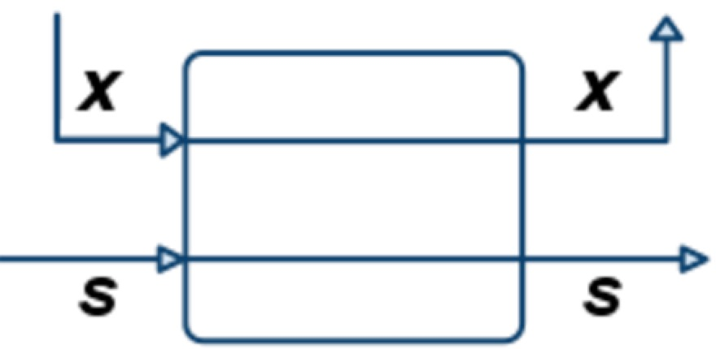
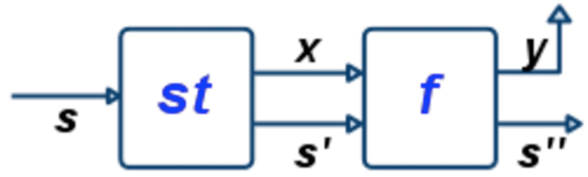

# Monad


One of the primary developments in the programming language community in recent years (starting in
the early 1990s) has been an approach to integrating the pure and impure camps, based upon the
notion of a “monad”. This note introduces the use of monads for programming with effects in Haskell.


```haskell
class Functor m where
  fmap :: (a -> b) -> m a -> m b
```

There is a typeclass called Functor that corresponds to the type constructors that you can map over.

For example, [] is a type that can be mapped. Actually, [] is an instance of Functor
```haskell
instance Functor [] where
  fmap f []     = []
  fmap f (x:xs) = f x : fmap f xs
```


Sometimes, we want the map can be applied on multiple parameters, like:
lift2 :: (a1 -> a2 -> b) -> Maybe a1 -> Maybe a2 -> Maybe b
lift2 :: (a1 -> a2 -> b) -> IO a1 -> IO a2 -> Maybe b
And we need these parameters are under same class type for map.

For this reason, there is a typeclass called Applicative that corresponds to the type constructors.
```haskell
liftA2 :: Applicative t => (a1 -> a2 -> b) -> t a1 -> t a2 -> t b
```


## Monad

Origin: when you are doing a division computation, there are danger div and safe div. When there
are zero-division happened, the results should be assigned to a special value.
Under this situation, I need to function whose signature is like this:
```haskell
apply :: (a -> Maybe b) -> Maybe a -> Maybe b
```
This means when we are playing with a function (a -> Maybe b), we need to judge the input which
is likely a Maybe a. When it is Nothing, we need to return Nothing, otherwise, it should return
f a.

And the pattern is like a sequence operation. You need to get more variables
from more `Maybe`, then you need a mechanism to wrap them all out. However, You
do not need to write a function with nested tuple type. You just need to make it
a sequence, which get `x1`, `x2`, ..., `xn` out and generate a `Maybe x`.

With abstraction mentioned above, Haskell implements (>>=) function.
```haskell
(>=) :: Maybe a -> (a -> Maybe b) -> Maybe b
m >= f = case m of
    Nothing -> Nothing
    Just x -> f x
```
This means you unwrap a variable out and then put it into a function and maybe
do more wraps before generate a final result.

So that the function of (>>=) is like a function that helps us sequence (处理) the parameter
before putting them into the target function. And the

```haskell
m1 >>= \x1 ->
   m2 >>= \x2 ->
   ...
     mn >>= \xn ->
       f x1 x2 ... xn
```
Then the parameters for f are safe. And I do not need to deal with Nothing parameters.

>It is COOL!

And they have a more readable version:
```haskell
do x1 <- m1
   x2 <- m2
   ...
   xn <- mn
   f x1 x2 ... xn
```
### Make a Type as Instance of Monad
The work for define a instance of Monad is two parts:
1. `return`
2. `>>=`

For every `data` type, there are some constructors, like `Maybe` you have `Just`
and `Nothing`, for `List` you have `Empty` and `Bind`.

For **return**, it lift a lower type to a higher Monad type. Here it consists of
characteristics of generics. If the Monad type consists generic type, like `Maybe a`
, you need to define how `a` lifted to `Maybe a`. Beside the work of lifting,
`return` needs to define some logic, like for `Maybe`, `return` lift `a` to `Just a`,
not to `Nothing`. And for `Either`, `return` lift `a` to `Right a` not `Left a`.
(Also, you need to make sure when calling `return a`, `a` is a type needed for `Right`).

Actually, we can see the define of `class Monad` for more details.
```haskell
class Applicative m => Monad (m :: * -> *) where
  (>>=) :: m a -> (a -> m b) -> m b
  (>>) :: m a -> m b -> m b
  return :: a -> m a
```
When defining a Monad, you need a subtype `m` which is a instance of Applicative.
Also, the most important, m must be a type class which accept a type and generate
a type. For example, `Maybe` is a type class actually, it need a type `a` to complete
a define a `Maybe`. And for Monad `Either`, the instance is written like this:
```haskell
instance Monad (Either e) where
    return = Right
    Left  l >>= _ = Left l
    Right r >>= k = k r
```

Why you can only make type class `*->*` to a Monad. The reason is that you only
need to **sequence** one variable once!

We know complete Either is `Either a b`. But we define `instance Monad (Either e)`
here, actually take `b` as a needed type for a complete Either. And logic takes
advantage of it. `b` (Right) is critical content for Either. `return` of Monad
Either takes in a `b`, and return `Right b`.

**Notice** the above description for Monad type define, it is the same with `>>=`.

For **>>=**, we need to define actions for different constructors of the generic
type (`b` for Either) separately. For example, `instance Monad List`, `List` has
two constructors, `Empty` and `Bind`. You need to define different `>>=` for the
two constructors.

### Logic for Defining a Monad

Monad transfer a monad type to a same monad type, from a list to list, from a Maybe
to Maybe, from Either to Either. Emphasis it again: monad type is a type class which
needs to accept one more type to generate a complete data type (no `->`).

The change is the underlying type which is needed to generate a complete data
type, from `List Int` to `List Bool`, from `Maybe Int` to `Maybe Bool`.

### Monad list

[] (list) is an instance of Monad.
```haskell
instance Monad [] where
    return x = [x]
    (x:xs) >>= f = f x ++ (xs >>= f)
```

Apply monad []

```haskell
do x <- [1, 2, 3]
   show x

-- show :: IO ()
-- So that the fast forward is good.
```
This is like a for loop according to list [1, 2, 3] because of Monad [] definition.


## State Transformer

```haskell
type ST a = State -> (a -> State)
    return :: a -> ST a
    return a = \s -> (a, s)
```

This means that when return a state value, just bind it with a inputed state.

The return work can be shown in the figure below:


```haskell
(>>=) :: ST a -> (a -> ST b) -> ST b
st >= f = \s -> let (x, t') = st t in f x t'
```
This means that a inputed state are supposed to be processed by function f.

The bind work can be shown in the figure below:


We conclude this section with a technical aside. In Haskell, types defined using
the type mechanism cannot be made into instances of classes.

we need to define `ST` as a data to make it as a instance of Monad.
```haskell
data ST0 a = S0 (State -> (a, State))

apply0          :: ST0 a -> State -> (a, State)
apply0 (S0 f) x = f x

instance Monad ST0 where
  -- return :: a -> ST a
  return x   = S0 (\s -> (x, s))
  -- (>>=)  :: ST a -> (a -> ST b) -> ST b
  st >>= f   = S0 $ \s -> let (x, s') = apply0 st s in
                          apply0 (f x) s'
```

Intuitively, `ST` is an action that takes in a old state and return a new state
. The bind `ST a -> (a -> ST b) -> ST b` first runs the action of `ST a`, then
transfer the result (State) to the next action of `ST b`. The performance is similar with
what combine the sequence of actions of `ST a` and `ST b`. At the same time, the
variable changed underlying is `State`. It allows us to combine simple actions to
get bigger actions. `apply` allows us to execute an action with some initial state.

To sum up, an action can be a Monad type. The intuitive idea here is that we can
get a new action from a old action by Monad bind. Through multiple binds, we can
get a complex action from a simple action.


### Example: Global Counter

Here, I give a example of a counter with Monad.

First, you can define a general tree data structure.
```haskell
Tree a = Leaf a
       | Node (Tree a) (Tree b)
```
Then I define a actual tree `tree: Tree Char`. My goal is to transfer it from
`tree :: Tree Char` to `tree :: Tree (Char, Int)`.

We can use Monad ST to achieve this. The intuition is that we need a `State = Int`
and a `ST State` which has action to transfer states. We can pre-order access
the original tree, and use ST to assign state value to each node in order to get
a new tree. From definition, it is transformation from `ST Int (Tree Char)` to
`ST Int (Tree (Char, Int))`. If we have implemented `Monad ST Int`, it is good
to do this, it is like a bind between `Tree Int` and `Tree (Char, Int)`.

Get back to `ST` staff. We define a `ST Int` with action of tick. Then we can
**bind** this tick action with a action to return a new tree. The reason why it
is appropriate to bind them is that **they are all ST Int**. Under this data
type, you are free to bind any subtype data, like `ST Int Int`, `ST Int Tree`.

### IO Monad

`IO` is also a Monad, the mechanism is similar to `ST`. `IO a` returns a result
of type a, but also perform some input/output **actions**.

```haskell
return  :: a -> IO a
(>>=)   :: IO a -> (a -> IO b) -> IO b
getChar :: IO Char
putChar :: Char -> IO ()
```
So that you can bind other `IO` to generate a complex `IO` action.

## Study Case: Parser

The goal of a parser is to generate a structured data from `String`. But for a
parser, mostly it cannot consume all the chars in the `String`, so that it need
to return the remaining `String` as well. At the same time, because of some
ambiguity, there are many possibilities for one-time parsing. To sum up,
evolutionary history for a parser is like:
```haskell
Parser :: String -> StructuredData
Parser :: String -> (StructuredData, String)
Parser :: String -> [(StructuredData, String)]
```

See, the format is much similar with the `ST` we've discussed above. The `State`
is `String` here, and the value of the action is a `StructuredData`.

Therefore, we want to define `Parser` as a new data type

```haskell
newtype Parser a -> P (String -> [(a, String)])
```

First as the `apply` above, we write a function to execute the `Parser` with a
input `String`.
```haskell
doParse :: P (String -> [(a, String)]) -> String -> [(a, String)]
doParse (P p) str = p str
```

Second, we need to define different parser for different actions. For example,
we want to parse out one character.
```haskell
oneChar :: P (String -> [(Char, String)])
oneChar = P (\str -> case str of
                        []     -> []
                        (x:xs) -> [(x, xs)]
```

Then we get this action and `doParse` on it.
```haskell
doParse oneChar "hey"
```

### Monad Parser

At this stage, we want to bind different parser together to do a conplex parse
job. Here, we need `Monad` again. The implementation for `Monad Parser` is that
```haskell
bindP p1 fp2 = P $ \cs -> [(y, cs'') | (x, cs')  <- doParse p1 cs
                                     , (y, cs'') <- doParse (fp2 x) cs']
```

With `Monad Parser`, we can define complex `Parser`.
```haskell
pairP       :: Parser a -> Parser b -> Parser (a, b)
pairP px py = do x <- px
                 y <- py
                 return (x, y)
```

The reason why in a **do** range, we only need to suck out `x` or `y`, is that
for binding, the only parameter the function need is a data with type `a`. `x`
and `y` are the data here. Also, intuitively, the `State (String)` is the underlying
data within `Monad Parser`, it will be processed during binding, but the action
is only defined in the definition of instance of `Monad`, so in user functions,
you do not need to care about `State`.


After the definition of `Monad Parser`, we can define some functions which can
help combine and take use of different parser, like `many`...

With the operators, we can try to define a parser for calculation expressions.
The right way to parse a expression is from top level to bottom level. For a
expression, parse a product (`*` or `/`) expression out first, then parse a add
operator (`+`, `-`) out, last recursively parse a expression out. This can
ensure the logic of computing right. Some implementation is like:

```haskell
sumE     = addE <|> prodE
  where
    addE = do x <- prodE
              o <- addOp
              y <- sumE
              return $ x `o` y

prodE    = mulE <|> factorE
  where
    mulE = do x <- factorE
              o <- mulOp
              y <- prodE
              return $ x `o` y

factorE = parenP sumE <|> oneInt
```

This code deal with the issue of order of computing, but it makes the computing
right-associated. For example, `10-1-1`, because the code want to split the
expression by `prodE`, it will parse `10` out, and take `1-1` as the second
operand.

To correct this, we need to find another `prodE`, compute the left-associated
result and keep going. The implementation is

```haskell
sumE1       = prodE1 >>= addE1
  where
    addE1 x = grab x <|> return x
    grab  x = do o <- addOp
                 y <- prodE1
                 addE1 $ x `o` y

prodE1      = factorE1 >>= mulE1
  where
    mulE1 x = grab x <|> return x
    grab  x = do o <- mulOp
                 y <- factorE1
                 mulE1 $ x `o` y

factorE1 = parenP sumE1 <|> oneInt
```

See, after finding a `prodE1`, it keeps finding another `prodE1`, compute the
result and tend to find next `prodE1`.

Actually, it is a chain format, you parse element sequentially, not just
divide-and-conquer. We can define some abstraction for it:
```haskell
p `chainl` op = p >>= rest
    where
      rest x   = grab x <|> return x
      grab x   = do o <- op
                    y <- p
                    rest $ x `o` y
```

when you've done the action of p, then do rest. The work of rest is to continue
do the action of p. So the processing order is same as left-to-right accessing
the string.
